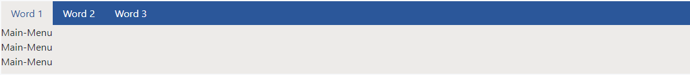
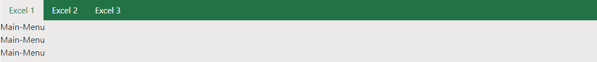
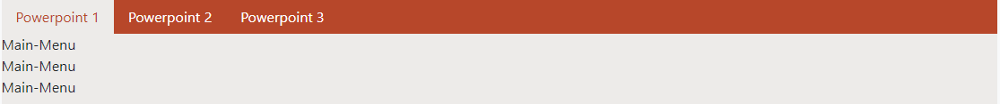
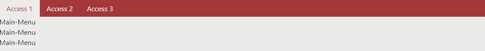
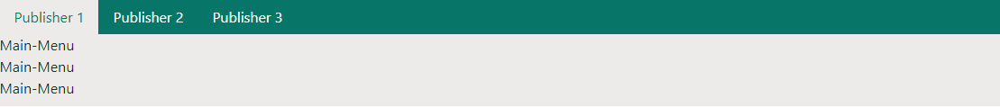
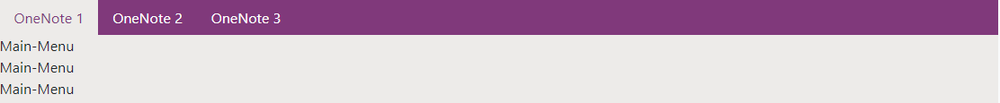

# Microsoft-Navigation
A Bootstrap 4 design with which you can create navigation bars in the design of Microsoft Office 2019 Word, Excel, Powerpoint, Publisher, OneNote.
## Installation
1. Download the latest version of [Microsoft-Navigation](https://github.com/MrCodingMen/Microsoft-Navigation/releases)
2. Include the library stored from GitHub     
    ```html
       <link rel="stylesheet" type="text/css" href="https://raw.githubusercontent.com/MrCodingMen/Microsoft-Navigation/master/src/css/style.css"/>
     ```
   or host it yourself
     ```html
       <link rel="stylesheet" type="text/css" href="path_to_file"/>
      ```
    
# Usage
### Create a new div with class `microsoft-nav` and `{theme-name}-style` for style. Then create normal tabs with Bootstrap 4
#### Available themes:
 1. Word - `word-style` 
 1. Excel - `excel-style` 
 1. Powerpoint - `powerpoint-style` 
 1. Access - `access-style` 
 1. Publisher - `publisher-style` 
 1. OneNote - `onenote-style` 

# Example
### [Demo](https://mrcodingmen.github.io/microsoft-natvigation/demo.html)
Word-Demo:

   ```html
                <div class="microsoft-nav word-style">
                    <ul class="nav nav-tabs" role="tablist">
                        <li class="nav-item">
                            <a class="nav-link" id="word-home-tab" data-toggle="tab" href="#word_1" role="tab">Word
                                1</a>
                        </li>
                        <li class="nav-item">
                            <a class="nav-link active" id="word-profile-tab" data-toggle="tab" href="#word_2"
                               role="tab">Word
                                2</a>
                        </li>
                        <li class="nav-item">
                            <a class="nav-link" id="word-contact-tab" data-toggle="tab" href="#word_3" role="tab">Word
                                3</a>
                        </li>
                    </ul>
                    <div class="tab-content">
                        <div class="tab-pane " id="word_1" role="tabpanel">
                            Main-Menu<br>
                            Main-Menu<br>
                            Main-Menu<br>
                        </div>
                        <div class="tab-pane active" id="word_2" role="tabpanel">
                            Second-Menu<br>
                            Second-Menu<br>
                            Second-Menu<br>

                        </div>
                        <div class="tab-pane " id="word_3" role="tabpanel">
                            Third-Menu<br>
                            Third-Menu<br>
                            Third-Menu<br>
                        </div>
                    </div>
                </div>
   ```
